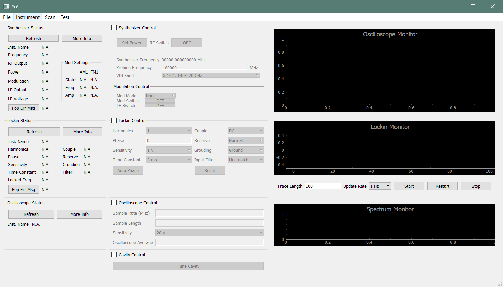
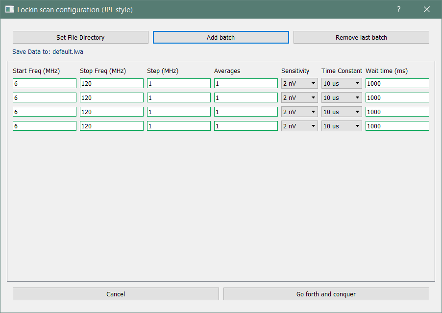
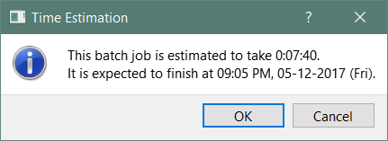
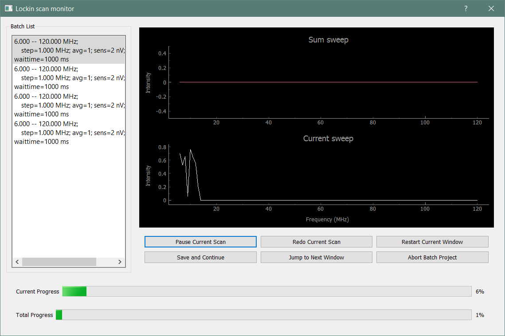

# User Guide for PySpec
### Luyao Zou
### Widicus Weaver Group
### Department of Chemistry
### Emory University

# Introduction

PySpec is a Python interface that is developed to control multiple instruments in the Widicus Weaver Group.
The goal of PySpec is to provide a universal, cross-platform GUI interface to facilitate spectroscopy experiments and data collection tasks, which were previously achieved by several individual customized CVI programs.
The advantage of PySpec is that it combines all these previous CVI programs into a universal GUI framework, which is more user-friendly, more robust, and more extensible.

# System Requirement

PySpec is developed in Python, and thus is supposed to be cross-platform.
Its behavior, however, does show small differences between Linux and Windows systems.
It is not tested in Os X, but the behavior is expected to be similar to Linux.

The following Python package and environments are required to run PySpec:

* Python 3
* PyQt 5: provides the GUI framework
* numpy: provides data array storage and manipulation functionality
* scipy: provides data manipulation functionality
* pyqtgraph: provides real time visualization. Built on PyQt
* PyVisa 1.8: provides API for VISA instruments. Requires National Instrument VISA C library.
* pyniscope from [Bernardo Kyotoku](https://github.com/bernardokyotoku/pyniscope "target=_blank"): provides API for National Instrument Digitizer Card. Requires National Instrument NISCOPE C library.

# Use PySpec

## Launch PySpec

Launching PySpec is straight forward.
Once all required packages and libraries are correctly installed,
activate a system terminal, and change the directory to the PySpec directory.

    cd your-system-dir/PySpec/

Execute the main python script `main.py` by your Python 3 interpreter.

    python main.py
    python3 main.py

In Windows, it is usually `python` if only Python 3 is installed.
In Linux, it is usually `python3` because both Python 2 and Python 3 are pre-installed in popular Linux distributions.

## The Main GUI Interface

The main GUI interface of PySpec is shown below.

It currently includes 10 panels distributed in three columns.
The left column panels monitor the instrument status of the Agilent synthesizer, SRS lock-in amplifier, and the NIPCI digitizer card (digital oscilloscope).
The center column panels controls the settings of the corresponding instrument.
The right column panels are real time monitors.
Some panels are still under development, so they may not be at their optimal performance.

Each center panel has a checked box that indicates the activation status of the panel.
Only when the correct instrument is connect will the control panel be activated.
This is an foolproof mechanism.

## Connect Instrument

Instruments need to be connected before being controlled.
To connect individual instrument, click the `Instrument` menu and select `Select Instrument`.
A selection window will pop up, with all currently available instruments listed.
Select the correct instrument address for each device you wish to connect, and then either proceed or cancel.

## View Instrument Status

The status of the instrument currently connected in PySpec can be viewed by accessing the `View Instrument Status` entry in the `Instrument` menu.
The instrument address, instrument name and manufacturer, if available, will be printed.

## Close Instrument

To disconnect an instrument, click the `Instrument` menu and select `Close Instrument`.
Instruments being checked after confirmation will be disconnected from PySpec.
The default is to check all instruments to be closed/disconnected.
If you wish to keep certain instruments, uncheck the boxes in front of them.
Due to some unresolved PyQt feature, you may need to click twice to actually uncheck the box.
Disconnected instruments, if still physically turned on and hooked up to the computer, can be reconnected in the `Selectin Instrument` panel.

## Control and Configure Instrumental Settings

Once the instrument is connected, the corresponding control panel will be activated.
Settings can be configured via drop-down selection menus and filled-in text boxes.
Foolproof mechanisms are enforced in PySpec so that only valid settings will be sent to the instrument.
For filled-in text boxes, a green frame indicates valid inputs, an orange frame indicates border-line inputs, and a red frame indicates invalid inputs.

### Synthesizer Control

#### The RF sector

This sector controls the RF frequency and power of the synthesizer.

* `Set Power`. Click this button will invoke an input dialog which the RF power of the synthesizer can be set.
Foolproof mechanism is implemented so that only RF values between -20 and 0 dbm can be input.
RF power is always automatically ramped up or down slowly.
`Set Power` button always turns on the RF output on the synthesizer, even when the power is set at -20 dbm.
To turn off the RF output, use the `RF Switch` toggle.

* `RF Switch` Toggle: switching on/off RF output on the synthesizer.
The text on the toggle button indicates the current RF status on the synthesizer.
The program will automatically ramp down the RF power when turning off the RF output.

* `Synthesizer Frequency`. This line of text displays the current radio frequency value on the synthesizer.

* `Probing Frequency`. Input the mm/submm frequency you wish to probe here.

* `VDI Band`. Select the VDI band on your system, thus the multiplication factor.
In the future, functionality will be developed to allow user configure their customized band profile.

#### The modulation sector

This sector configures the internal modulation applied on the synthesizer RF waveform.
Currently, this sector only includes the sine-wave AM and FM modes that we normally use in our experiments.
Other modulation functionalities are available in the synthesizer and can be programmed in the future when necessary.

### Lock-in Control

This panel includes popular SRS 830 lock-in amplifier settings.
Currently, the program only supports the configuration and output for Channel A.
Controls on Channel B can be added in the future when necessary.

### Oscilloscope Control

Under development.

### Motor Control

Under development. This is designed for the cavity enhanced experiment.

## Start A Scan

Click Menu `Scan` and select a scan mode.
The scanning dialog will only be activated if the required instruments are correctly connected to PySpec.
Currently the `JPL Scanning Routine` and `Pressure Reader` work.
The other two modes are under development.

### JPL Scanning Routine

This scanning routine mimics the basic functionality of the JPL scanning routine.
It takes the lock-in amplifier output signal via a GPIB/VISA port.

#### Scan Configuration

The first window is a configuration window, where batch scans can be scheduled.
It will not proceed before you clear all invalid settings.
You can add or remove batch scans by clicking the `Add batch` and `Remove last batch` buttons.
When a new batch item is added, settings from the previous item will be duplicated as a default input, except for the start and stop frequencies.
The wait time needs to be at least larger than 2pi*(time constant) to prevent rolling sinusoidal waves in the spectrum.
3pi is recommended.

Once the scan batch is correctly configured, one can proceed to the data acquisition.
An time estimation dialog will pop up to remind the user how long the batch job will take.

If the time is too long, one can click `cancel` to go back to the configuration window.
Previous settings will be preserved during this process.
If the time looks fine, one can proceed.

#### Scan In Progress

The batch scan progress will be monitored by a second pop-up window.

The left panel displays the settings configured for each batch item.
The current scan is highlighted.
(The current panel format is primitive; it requires future development.)

The right panel displays the spectrum of the current scan.
The top monitor displays the averaged spectrum, whereas the bottom monitor displays the on-going scan.
Several control buttons are available below the monitors.
You can pause, restart, skip, and save the current scan, and even abort the whole batch.

The bottom of the window displays two progress bars: one for the current batch item, and another one for the whole batch.
The progress is calculated based on the number of data points to be taken, not the actual time spent during the scans.
Therefore, even if the scans are skipped, paused or restarted, the estimation of the batch progress is relatively accurate.

### Oerlikon Pressure Reader

This window controls the Oerlikon pressure gauges via its CENTER TWO pressure gauge readout.
The window layout is simple: it contains a status panel, a control panel and a real-time monitor.
You can select the channel and pressure unit in the control panel.
In order to give the pressure gauge readout sufficient time to respond, the fastest data update rate is 10~Hz.
Don't worry, the unit of the pressure and data update period will be written into the data file header.
The current pressure is always updated in real time in the status panel, regardless of the status of the data acquisition.
To start record pressure readings, click on the `(Re)start` button.
Notice that the data are plotted in log scale by default, but you can change it back to regular scale by right clicking the canvas,
and select `Plot Options` -> `Transforms` -> `Log x` or `Log y`

Do not perform FFT on the data, or the program may crash.
This is a problem in the package `pyqtgraph`.
